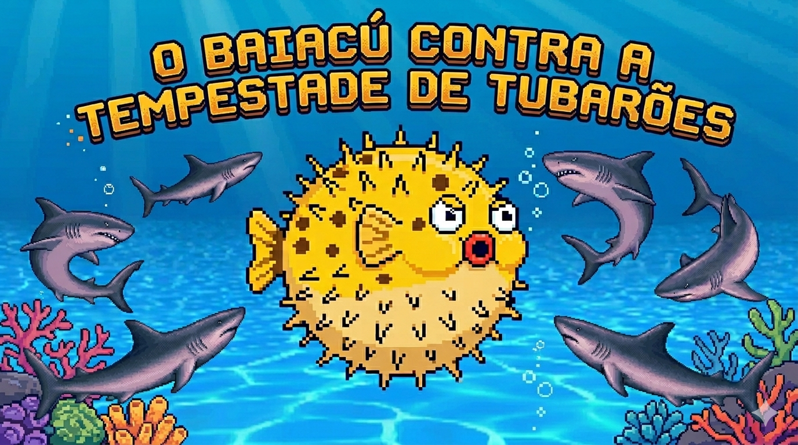
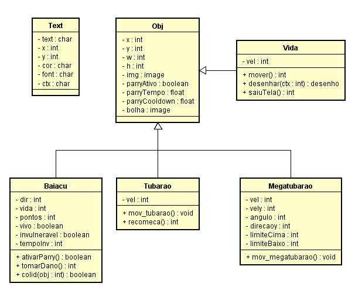
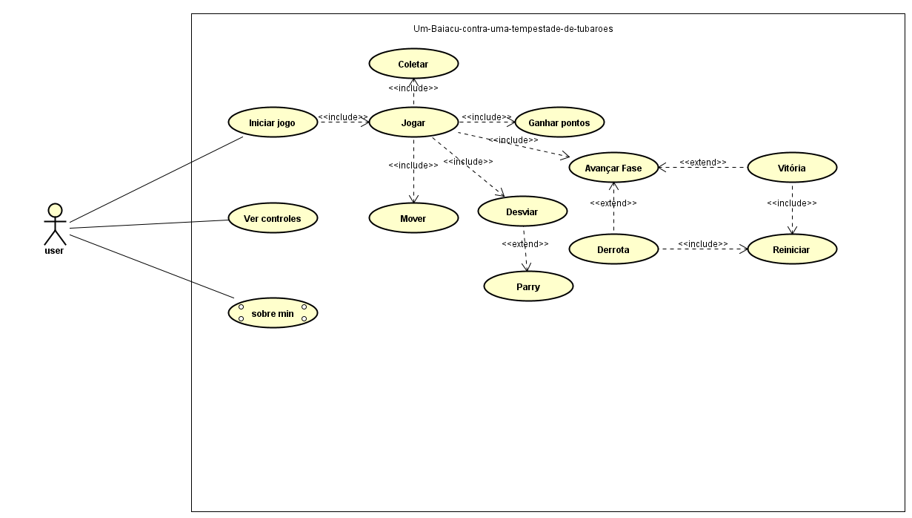
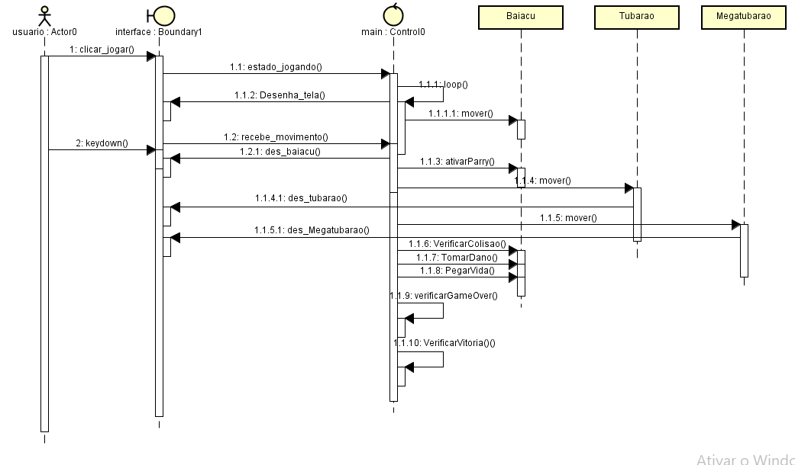

# 🐡 Baiacu vs Tubarões

## 👤 Desenvolvedor
Abel Silva Neto

## 🖼️ Banner


---

## 📐 Modelagem e Documentação do Sistema
## 📊 Diagrama de Casos de Uso


## 🧱 Diagrama de Classes


## 🔄 Diagrama de Sequência


## ⚙️ Requisitos Não Funcionais (RNF)
RNF01 (Tecnologia)
O sistema foi desenvolvido em JavaScript, compatível com navegadores modernos sem necessidade de transpilação.

RNF02 (Portabilidade)
O jogo roda diretamente no navegador utilizando HTML5 Canvas.

RNF03 (Usabilidade)
A interface foi projetada para uso em computadores, com layout adaptado para resolução 1200x700 (canvas do jogo).

RNF04 (Desempenho)
O jogo utiliza requestAnimationFrame, garantindo fluidez e taxa de quadros estável (~60 FPS).

## 📏 Regras de Negócio (RN)
RN01 (Dificuldade Progressiva)
A velocidade dos inimigos aumenta conforme a progressão das fases.

RN02 (Troca de Cenário)
Cada fase possui um fundo diferente, indicando evolução no jogo.

RN03 (Vitória)
O jogador vence ao atingir 1200 pontos com pelo menos 1 vida restante.

RN04 (Manual de Instruções)
O jogo possui uma tela de controles explicando comandos e mecânicas.

## 🧩 Requisitos Funcionais (RF)

RF01 - Movimentação
O jogador pode se mover verticalmente (eixo Y).

RF02 - Sistema de Vidas
O jogador inicia com 5 vidas e perde ao colidir com inimigos.

RF03 - Pontuação
O jogo possui sistema de pontuação contínua.

RF04 - Coletáveis
Itens de vida aparecem e podem ser coletados.

RF05 - Progressão de Fases
O jogo possui 3 fases com aumento de dificuldade.

RF06 - Interface (Telas)
O sistema possui:

Menu inicial
Tela de jogo
Tela “Sobre”
Tela de controles
Tela de vitória
Tela de derrota

RF07 - Tela "Sobre"
Exibe informações do desenvolvedor e Product Owner.

## 🎮 Visão Geral do Sistema

### 📌 Descrição
Este projeto é um jogo 2D desenvolvido em JavaScript onde dois jogadores controlam baiacus que precisam sobreviver a ataques de tubarões.

### 🎯 Objetivo
Desviar dos inimigos e sobreviver o máximo possível, acumulando pontos até atingir a vitória.

### 🌊 Tema
O jogo se passa no fundo do mar, onde baiacus enfrentam tubarões comuns e um mega tubarão em fases avançadas.

---

## 🕹️ Jogabilidade

### 🎮 Controles

**Jogador 1:**
- W → subir
- S → descer
- SHIFT → parry

**Jogador 2:**
- ↑ → subir
- ↓ → descer
- ENTER → parry

---

### ❤️ Sistema de Vida
- Cada jogador começa com 5 vidas
- Pode coletar corações para recuperar vida

---

### ⭐ Pontuação
- Pontuação contínua estilo *Subway Surfers*
- Aumenta com o tempo

---

### 🧠 Progressão de Fases
- Fase 1 → início (inimigos lentos)
- Fase 2 → inimigos mais rápidos
- Fase 3 → Mega Tubarão + dificuldade crescente

---

### 🏆 Vitória
- O jogo termina quando um jogador atinge **1200 pontos**
- Uma tela de vitória é exibida

---

## ⚙️ Especificações Técnicas

- Linguagem: JavaScript
- Renderização: Canvas (HTML5)
- Loop principal: `requestAnimationFrame`
- Sistema de estados:
  - menu
  - jogo
  - gameover
  - vitória

---

## 👨‍🏫 Créditos

- Desenvolvedor: Abel Silva Neto  
- Product Owner: Carlos Roberto da Silva Filho  

---

## 🌐 Link do Jogo

https://baiacu-the-game.vercel.app/

## 💻 Como Executar o Projeto

### 1. Clonar o repositório
```bash
git clone https://github.com/seu-usuario/seu-repositorio.git

index.html

## 📁 Estrutura do Projeto

```bash
(📁 projeto-baiacu/
│
├── 📄 index.html        # Página principal (canvas do jogo)
├── 📄 index.js          # Lógica do jogo
├── 📄 style.css         # Estilo da página
│
├── 📁 models/
│   └── 📄 Carro.js      # Classes do jogo (objetos, inimigos, etc)
│
├── 📁 img/
│   ├── 🖼️ fundo.png
│   ├── 🖼️ fundo2.png
│   ├── 🖼️ fundo3.png
│   ├── 🖼️ capa.png
│   ├── 🖼️ vitoria.png
│   ├── 🖼️ baiacu_0_bg.png
│   ├── 🖼️ baiacu_1_bg.png
│   ├── 🖼️ mega_tubarao1.png
│   ├── 🖼️ coracao.png
│   └── ...
│
├── 📁 diagrams_uml/
│   ├── 📄 caso_de_uso.uml
│   ├── 📄 classe.uml
│   └── 📄 sequencia.uml
│
└── 📄 README.md)
